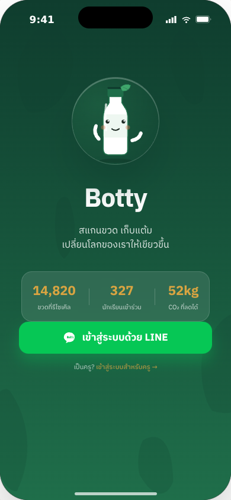
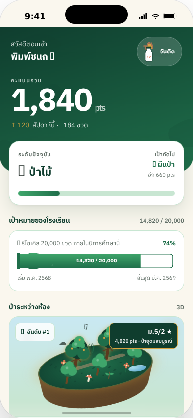
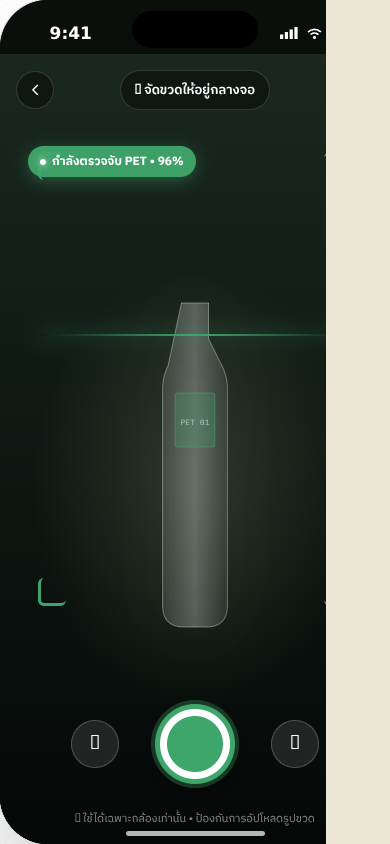
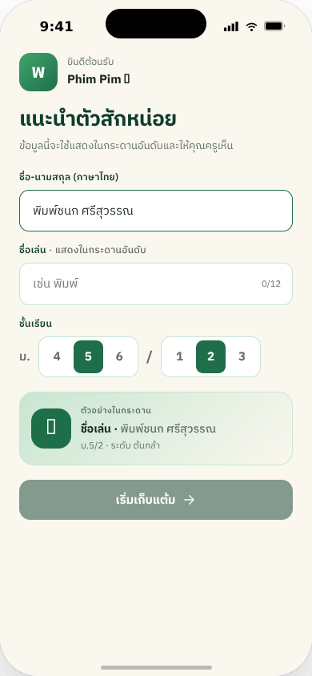
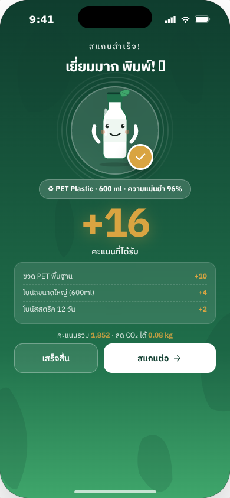
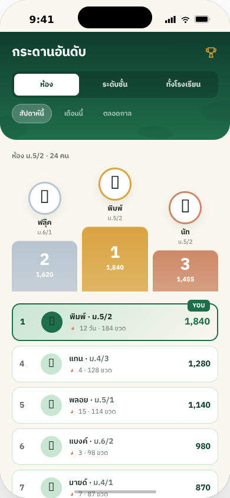
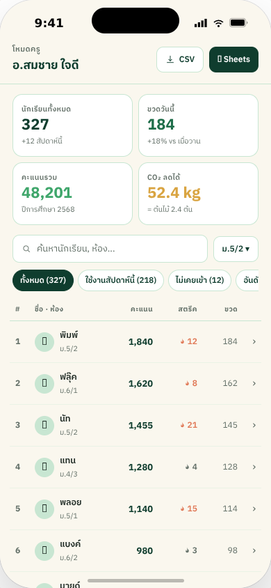
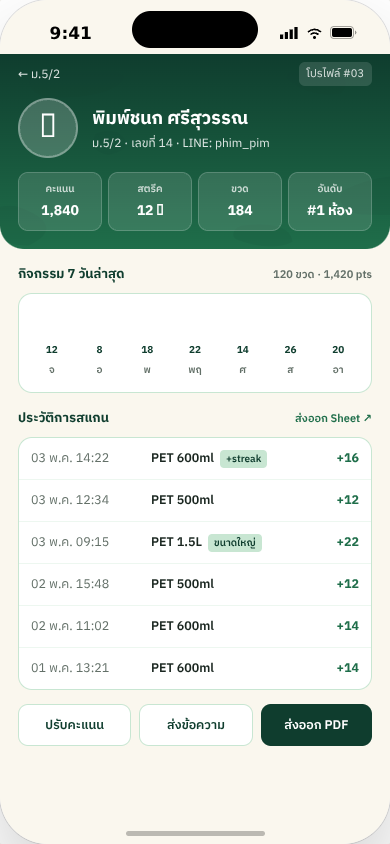

# botty-liff-app

A school recycling rewards system running as a [LINE LIFF](https://developers.line.biz/en/docs/liff/) webview. Students scan plastic bottles with their phone camera, an AI model verifies the bottle, and points/coins are awarded — either instantly or after a staff confirmation step, depending on configuration. Points feed a leaderboard, and coins can be spent in an in-app shop to decorate a personal garden.

## Screenshots

*Rendered from the design canvas, 390×844.*

### Student flow

| Login | Home | Camera scan |
|---|---|---|
|  |  |  |

| Onboarding | Reward | Leaderboard |
|---|---|---|
|  |  |  |

### Teacher flow

| Dashboard / student list | Student profile |
|---|---|
|  |  |

## How it works

1. **Login** — the app bootstraps inside the LINE app: the LIFF SDK provides a LINE `idToken`, which the backend exchanges for a Firebase custom token. New users go through `/onboard`; returning users land on `/home`.
2. **Scan** — the student photographs a bottle at `/scan`. The image is uploaded to Vercel Blob, an AI workflow classifies it, and a **pending** award is built.
3. **Confirm** — what happens next depends on `BIN_CONFIRM_MODE`:
   - `enforce` (default): points stay locked until the student scans a rotating staff QR code. Council/admin staff open `/approver` to run a 5-minute session of 30-second single-use QR slots.
   - `log`: award instantly, but record the attempt.
   - `off`: legacy instant award.
4. **Spend** — earned coins can buy garden decorations and terrain in the shop.

Abuse guards on the scan flow: duplicate-image hash detection, 60s cooldown, daily limit of 20 scans, and IP rate limiting.

## Stack

- **Next.js 16** (App Router, React 19, Turbopack)
- **Firebase** — Auth (custom token from LINE idToken) + Firestore
- **LINE LIFF SDK** (`@line/liff`)
- **Vercel Blob** — scan image storage
- **Google Sheets API** — teacher exports
- **Tailwind CSS 4**, **Vitest**

## Getting started

```bash
npm install
vercel env pull      # sync .env.local from Vercel (needs Vercel CLI + project link)
npm run dev          # http://localhost:3000
```

Note: most flows require a LINE LIFF context and Firebase credentials — see the env table below.

### Commands

```bash
npm run dev          # next dev (Turbopack)
npm run build        # next build
npm test             # vitest run
npm run test:watch   # vitest watch mode
npm run lint         # eslint
npx tsc --noEmit     # typecheck
```

## Environment variables

| Var | Use |
|---|---|
| `NEXT_PUBLIC_LIFF_ID` | LINE LIFF init |
| `NEXT_PUBLIC_FIREBASE_*` | Firebase client config |
| `LINE_CHANNEL_ID` | LINE idToken verification |
| `GCP_SERVICE_ACCOUNT_JSON` | Firebase Admin + Google Sheets |
| `GCP_PROJECT` | Firebase project id |
| `BLOB_READ_WRITE_TOKEN` | Vercel Blob writes |
| `BIN_CONFIRM_MODE` | `off` / `log` / `enforce` (default `enforce`) — gates the staff-QR confirm step |
| `STAFF_QR_SECRET` | HMAC secret for staff-QR slot tokens; required unless `BIN_CONFIRM_MODE=off` (min 16 bytes) |

## Routes

| Route | Who | What |
|---|---|---|
| `/` | all | LINE login bootstrap → `/onboard` or `/home` |
| `/home`, `/scan`, `/history`, `/leaderboard`, `/profile` | student | Core student flows |
| `/garden`, `/shop` | student | Spend coins on garden decorations and terrain |
| `/tutorial` | student | First-run walkthrough |
| `/approver` | council/admin | Rotating staff-QR sessions for scan confirmation |
| `/teacher`, `/teacher/student` | admin | Dashboard, KPIs, Sheets export, point adjustments |
| `/admin` | admin | User management, adjustment approvals, audit |
| `/api/v1/*` | — | Backend routes (Node runtime); bearer = Firebase ID token |

## Roles

`student` → `council` → `admin`.

- **student** — scan, earn, spend.
- **council** — everything a student can, plus running approver QR sessions.
- **admin** — full access: user management, point adjustments, approvals, audit, teacher dashboard. Set manually in Firestore only (never via API). Admins can assign/revoke `council` through the API.

Point adjustments by staff: ≤±10 apply immediately; ±11–50 require a second admin's approval.

## Project layout

```
src/
  app/               # routes + API handlers (App Router)
    api/v1/          # backend endpoints (auth, scan, shop, garden, approver, admin, ...)
  server/            # domain logic + Firestore repos, pure functions with co-located tests
  lib/               # client API wrapper (api.ts), Firebase client, theme
  components/shared/ # BottomNav, DesktopBlock, ...
```

## Testing

Pure functions live under `src/server/**` with co-located `*.test.ts` (Vitest). Firestore repos are not unit-tested; they are verified manually and via integration through the API routes.

## Deployment notes

- Deployed on Vercel. A Git "Ignored Build Step" (`scripts/vercel-ignore-build.sh`) skips builds for commits touching only `.beads/` or `*.md`.
- Firestore needs composite indexes and TTL policies enabled after deploy (collections `scanAttempts`, `scanReservations`, `pendingSlots`) — see [AGENTS.md](AGENTS.md#post-deploy-scanattempts-indexes--ttl) for the exact steps.

## Contributing / agent docs

- [AGENTS.md](AGENTS.md) — full project context: domain quirks, role model, post-deploy ops.
- Issue tracking uses **bd (beads)**: `bd ready`, `bd show <id>`, `bd close <id>`.
